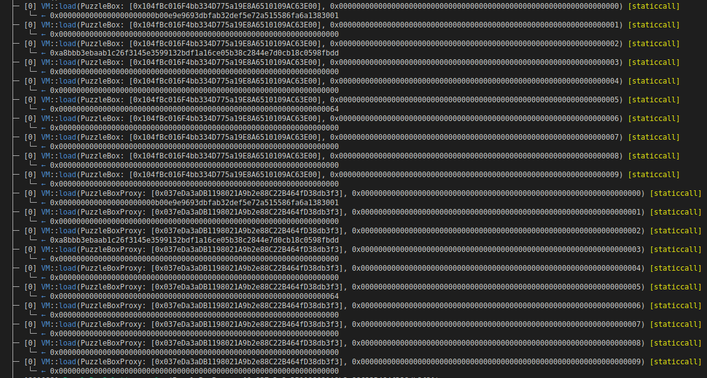

# Dragonfly CTF Walkthrough: Puzzlebox.sol

Hello anon, welcome to KweenBirb's walkthrough of Dragonfly's recent CTF, held May 6-8 2023, featuring hackable quirks of Solidity and the EVM at large.

This walkthrough details the process of deciphering and auditing Puzzlebox.sol, a Solidity puzzlebox containing metaversal secrets so powerful they can be leveraged to save the internet from exploitation by bad actors.

#### Spoiler alert: I didn't win any of the prizes offered by Dragonfly to those who completed the CTF quickly and efficiently. The lucky few who did, were awarded Milady Maker NFTs which are currently selling for a floor of 3.8 ETH or just over $7000! Pretty damn awesome prizes, if you ask me. Next time I'll allot more time to the CTF rather than let that pesky 'personal life' stuff get in the way :P

## Getting the lay of the land

First things first! I started with reading the documentation to get an understanding of the smart contract architecture and operation of the Puzzlebox file on a high level.

Dragonfly provides a convenient [Foundry git repo](https://github.com/dragonfly-xyz/puzzlebox-ctf) with a nifty diagram of the contract structure including information about the way that the CTF is scored.

Some first impressions: the CTF is centered around a proxy scheme, something very familiar to smart contract security researchers like me and you, anon. There are 3 contracts of interest: PuzzleBox contract provides the logic implementation, the PuzzleBoxProxy contract serves as proxy that interfaces with PuzzleBox, and the PuzzleBoxFactory provides functions to deploy and initialize state in order to simulate constructor functions which cannot be used in proxy schemes.

The PuzzleBoxSolution contract provides an unimplemented function called ```solve()``` where our CTF solutions should be provided. This function gets called by a shell contract to complete the CTF's many challenges, record how many solutions we come up with, and issue us a score based on correct solutions and their level of gas efficiency.

## Priming the solve() call with important variables

Now that we understand the CTF uses a proxy pattern and that we must provide our solution to the CTF via PuzzleBoxSolution's ```solve()``` function, we can start priming a few important memory variables for use. For more familiar nomenclature, I renamed the PuzzleBox instance ```puzzle``` provided to ```solve()```:

```address proxy = address(puzzle);```

We'll also need to locate the PuzzleBoxFactory and use it to find the implementation address. The factory is created and stored in the PuzzleBox.t.sol test file which is the one used to set the onchain environment and then invoke our PuzzleBoxSolution's ```solve()``` function. To grab it, I just wrote some code to poke and prod around the test contract:

```address impl = address(_factory.logic());```

Now when we run ```forge test -vvvv``` we can see both the PuzzleBoxFactory address and the logic implementation in the stack traces. Returning to PuzzleBoxSolution, I hardcoded the factory address and used its public method to grab the impl.

```
address factory = 0x5615dEB798BB3E4dFa0139dFa1b3D433Cc23b72f;
address impl = PuzzleBoxFactory(factory).logic();
```

## First places to look in the codebase

Right off the bat, common proxy pattern vulnerabilities come to mind as a great place to start looking for ways to hack the Puzzlebox. These include privilege escalation via uninitialized logic implementation contract, the famed Exploding Kittens selfdestruct vulnerability, storage collisions between the logic and proxy contracts, and careless implementations of the delegatecall opcode.

##### To avoid adding unnecessary extra gas costs to our solve() function, I included all code for poking and prodding that doesn't actively contribute to hacking the CTF in the test_win() function within PuzzleBox.t.sol. This lets us keep an eye on important variables and answer our questions without detracting from our score!

Let's start by checking for initialization status on the proxy:

```
bool init = _puzzle.isInitialized();
```

OK, 0x01 is returned so nothing's out of place there. Let's check the impl contract:

First, ```$ cast sig 'isInitialized()'``` will give us the bytes4 function selector, 0x392e53cd, that we will need to provide in calldata.

```
(bool a, bytes memory b) = impl.call(hex'392e53cd');
```

0x00! That's some valuable information to keep in mind for later! Uninitialized logic implementations can be vulnerable to privilege escalation or Exploding Kittens, so that may be an avenue to explore.

## Working backwards

Knowing that the Dragonfly CTF is centered around opening a puzzlebox, it seems safe to guess that the PuzzleBox contract's ```open()``` function serves as the final step of completing the challenge. From there, we can work backwards with suspected avenues of attack.

In ```open()```, we see a comment that confirms my suspicions:

```// Congrats ;-)```

So let's identify the requirements for calling ```open()``` and earn that congratulatory comment.

Strikingly, there are three modifier functions attached: ```maxBalance(0)```, ```maxDripCount(0)```, and ```minTotalDripped(10)``` A quick CTRL+F takes us to these functions where, unsurprisingly, their logic reflects their names.

```maxBalance(0)``` tells us we must find a way to drain the contract's Ether balance entirely, since even ```unchecked``` underflow would not satisfy ```address(this).balance <= 0```

```maxDripCount(0)``` appears to refer to the ```drip()``` function which increments the uint256 variable in storage named ```dripCount``` We'll either need to prevent the increment from happening or decrement ```dripCount``` using the internal ```_burnDrip()``` function.

```minTotalDripped(10)``` also appears to refer to the ```drip()``` function, because it increments yet another storage uint named ```lastDripId``` This storage uint must however somehow reach 10 while satisfying ```maxDripCount(0)```

If we can satisfy those three modifiers and provide a valid ```bytes calldata adminSig``` that resolves to the admin address, we win!

Now we have a destination in mind, with some functions we know we'll have to exploit. At this point, I decided to go back to probing the storage layout since we had already identified one potential issue that may lead us in the right direction without having to toil line-by-line.

## Continuing the common proxy vulnerabilities rabbithole

As we already know, proxy contracts can easily give rise to storage collisions without careful attention. To continue examining the integrity of the proxy architecture, storage layout should be enumerated. Since the impl contract is uninitialized, we should call initialize with the same parameters as the proxy contract so we can compare them as apples to apples:

```
    // initialize impl to then read impl's storage layout
    address payable[] memory friends = new address payable[](2);
    uint256[] memory friendsCutBps = new uint256[](friends.length);
    friends[0] = payable(0x416e59DaCfDb5D457304115bBFb9089531D873B7);
    friends[1] = payable(0xC817dD2a5daA8f790677e399170c92AabD044b57);
    friendsCutBps[0] = 0.015e4;
    friendsCutBps[1] = 0.0075e4;
    PuzzleBox(impl).initialize{value: 1337}(
        // initialDripFee
        100,
        friends,
        friendsCutBps,
        // adminSigNonce
        0xc8f549a7e4cb7e1c60d908cc05ceff53ad731e6ea0736edf7ffeea588dfb42d8,
        // adminSig
        (
            hex"c8f549a7e4cb7e1c60d908cc05ceff53ad731e6ea0736edf7ffeea588dfb42d8"
            hex"625cb970c2768fefafc3512a3ad9764560b330dcafe02714654fe48dd069b6df"
            hex"1c"
        )
    );
```

In running the code above, two things stand out. 

First, the admin's signature 
```0xc8f549a7e4cb7e1c60d908cc05ceff53ad731e6ea0736edf7ffeea588dfb42d8625cb970c2768fefafc3512a3ad9764560b330dcafe02714654fe48dd069b6df1c```
and nonce are accepted without issue as we replay it to the impl contract. This implies that the domain separator used to generate the signature _does not contain the contract address_ as an entropy seed to guard against cross-contract signature replay. Another thing worth keeping in mind as we move forward!

Second, a discerning eye will notice that the nonce 
```0xc8f549a7e4cb7e1c60d908cc05ceff53ad731e6ea0736edf7ffeea588dfb42d8```
provided to the initialize function is identical to the ```bytes32 r``` value of ```adminSig``` Non-incrementing nonces aren't necessarily a vulnerability, but reusing the r value as a nonce could pose some problems in certain scenarios so we'll also keep tabs on that.

## The storage layouts 'diff' approach

Now that we've initialized the impl contract using the exact same calldata as the admin used to init the proxy contract, we can compare the two layouts like a 'diff' to identify any colliding slots and variables.

To do so, I just iterated over the first n slots of both contracts while calling Foundry's awesome vm.load() cheat code and observed the results in the resulting stack traces. I chose ```n == 10``` since the PuzzleBox contract has 10 declared storage items and the PuzzleBoxProxy contract has 2 declared storage items (the ```PuzzleBox private immutable _logic``` is not actually kept in storage since it is immutable). Since mapping indices are kept empty, ~10 iterations should be enough to get a good insight into the storage slot layout.

```
// proxy storage layout
for (uint i; i < 10; ++i) {
    bytes32 implStorageVal = vm.load(address(_puzzle), bytes32(i));
}

// impl storage layout
for (uint i; i < 10; ++i) {
    bytes32 implStorageVal = vm.load(impl, bytes32(i));
}
```

Here's the output:


From this we can decipher the following intended layout:
Slot 0 (packed): ```bool isInitialized``` with ```address admin```
Slot 1: ```address operator```
Slot 2: ```bytes32 friendshiphash```
Slot 3: ```uint256 lastdripid```
Slot 4: ```uint256 dripcount```
Slot 5: ```uint256 dripfee```
Slot 6: ```uint256 leakcount```
Slot 7: ```mapping isValidDripId```
Slot 8: ```mapping signatureConsumedAt```

## 🚩🚩 Red flag alert 🚩🚩

The storage layout between both contracts is identical! The logic implementation should not have the same storage layout as the proxy because the proxy has a couple additional storage variables. 

Generally, a logic implementation used as the backend for a proxy includes a safety offset implemented in storage layout. _This works similarly to Solidity's scratch-space memory allocation for memory offsets 0x00 to 0x39 a reserved location used for calculating hashes without colliding with other memory pointers that start at offset 0x40._

We've found storage collision vulnerabilities! 

The first is benign: namely that PuzzleBoxProxy's slot 0 containing ```isFunctionLocked``` mapping overlaps PuzzleBox's packed variables, ```bool isInitialized``` bool and ```address admin```. Since mappings are dynamic, their slot indices are only used to find an unreachable starting slot via hashing. This means we can't abuse the first collision.

The second, however, is not benign: PuzzleBoxProxy's slot 1 containing ```address owner``` overlaps PuzzleBox's ```address owner```. This means that although the proxy's owner address is set in its constructor, it can actually be overwritten by setting the operator variable using ```PuzzleBox.operate()```

So let's do it!

##### Quick takeaway: if a safety offset in storage had been used or ```owner``` had been marked immutable or if the logic implementation had been initialized, there would be no hack available.

## Become operator

//here


locked functions:
0x925facb1 torch()

unlocked functions:
0x91169731 initialize()
0xb2e327e2 befriend()
0x7159a618 operate()
0x9f678cca drip()
0x2b071e47 spread()
0x00919055 zip()
0x8fd66f25 leak()
0x11551052 creep()
0x262ae75f creepForward()
0x58657dcf open()


1. unlock torch by utilizing operator == owner storage collision in order to call ```lock(torch.selector, false)```
2. to satisfy torch's burnDripId(5) modifier, exploit reentrancy in drip to bypass fee exponentiation and raise lastDripId to 5
3. use torch()'s _burndrip call to reach into other storage slots? (provide encodedDripId that overwrites another value, eg lastdripid and admin)
    - must set isValidDripId[lastDripId] = true
    - use storage collision of friendshipHash <-> lastDripid to set it to true?

